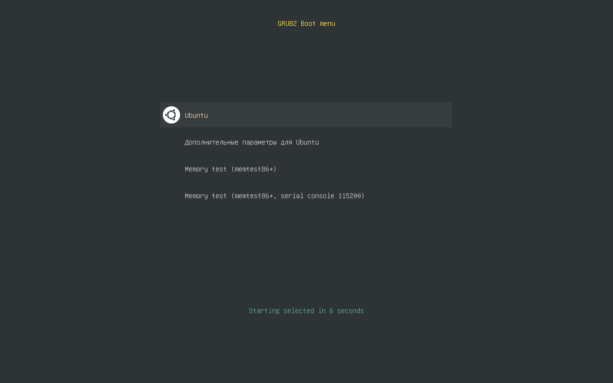

### grub2-zenburn ###

Easy on the eyes GRUB2 theme, with zenburn colours!


Based on [Matter theme][1]

Made with awesome theme preview tool [grub2-theme-preview][2].
Check it out!

### Installation ###

Clone and run: `sudo ./install.sh`

### Removal ###

Delete or comment out the line in `/etc/default/grub` file
```
GRUB_THEME="/boot/grub/themes/zenburn/theme.txt"
```
And then `sudo update-grub`.

[1]: https://github.com/mateosss/matter "Matter theme on Github"
[2]: https://github.com/hartwork/grub2-theme-preview "grub2-theme-preview on Github"